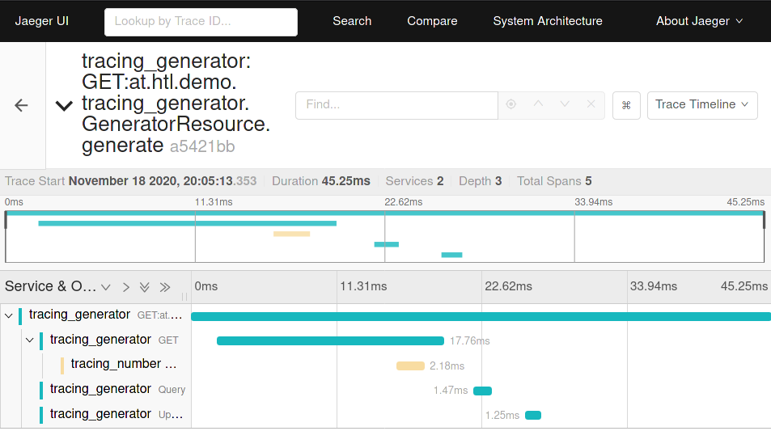

= Project for demonstrating OpenTracing with Quarkus and Jager
GeorgSeng
1.0, 2020-11-05
:toc:
:toc-title: Contents
ifndef::backend[:backend: html5]
:icons: font

== Project structure

The Project contains 2 Quarkus-Services, a dockerized postgress DB and a dockerized Jager.

=== Docker

==== Postgress

----
docker run -d -p 5432:5432 --name postgresql -e POSTGRES_PASSWORD=passme -e POSTGRES_USER=db postgres
----

==== Jaeger

----
 docker run -p 5775:5775/udp -p 6831:6831/udp -p 6832:6832/udp -p 5778:5778 -p 16686:16686 -p 14268:14268 jaegertracing/all-in-one:latest
----

the Dashboard is reachable via link:http://localhost:16686/search[Dashborad]

=== Quarkus

Both services and the JDBC-Driver for the DB get performance traced by jager that is in the same network as the services.

==== tracing_generator

Sends the local unixTime to the tracing_number service and saves the result in a postgres-DB.

Depends on the postgres-DB.
Endpoint: GET localhost:8080/generate

==== tracing_number

This service runs at localhost:8081 and gets calcs to check if the input number is a primenumber.

